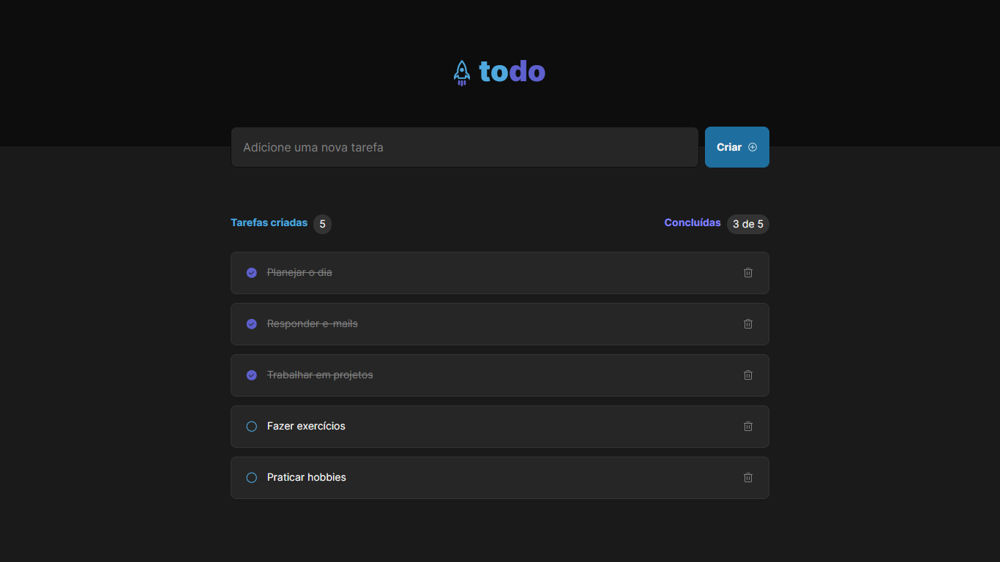

<h1 align="center" style="text-align: center;">
  
</h1>

<p align="center">
  <a href="#project">Projeto</a>&nbsp;&nbsp;&nbsp;|&nbsp;&nbsp;&nbsp;
  <a href="#technologies">Tecnologias</a>&nbsp;&nbsp;&nbsp;|&nbsp;&nbsp;&nbsp;
  <a href="#usage">Utilização</a>&nbsp;&nbsp;&nbsp;|&nbsp;&nbsp;&nbsp;
</p>

<h2 id="project">📁 Projeto</h2>

To-do é uma aplicação simples desenvolvida em ReactJS para gerenciamento de tarefas diárias. Utilizando os conceitos e fundamentos da ferramenta para a conclusão do desafio do capítulo 1 do ignite 2024.

- Adicionar uma nova tarefa
- Marcar e desmarcar uma tarefa como concluída
- Remover uma tarefa da listagem
- Mostrar o progresso de conclusão das tarefas



<h2 id="technologies">💻 Tecnologias</h2>

Este projeto foi desenvolvido com tecnologias como:

- Vite;
- React Js;
- Css Modules;
- TypeScript;

<h2 id="usage">💡 Utilização</h2>

Você também pode executá-la em sua máquina localmente. Certifique-se de ter o `Node.js` e o `npm` instalados antes de prosseguir com as etapas abaixo:

1. Clone o projeto:

```
$ git clone https://github.com/sdc-jeferson/01-Ingnite-Todo-List-Challenge.git
```

2. Acesse a pasta do projeto:

```
$ cd todo-list
```

3. Instale as dependências:

```
$ npm install
```

4. Inicie o servidor:

```
$ npm run dev
```

<p align="center">
Developed by Jeferson 👋🏾
</p>
